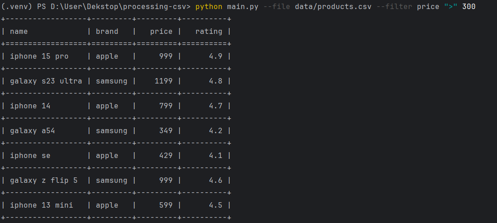
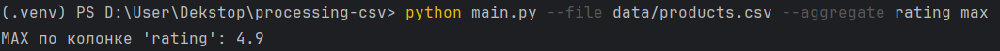

# CSV Tool: фильтрация и агрегация

Простой скрипт на Python для обработки CSV-файлов.

## 🔧 Возможности

- Фильтрация по колонке с оператора

- Агрегация по колонке: avg, min, max



- Поддержка числовых и текстовых значений

## 📦 Установка зависимостей

```bash
pip install tabulate